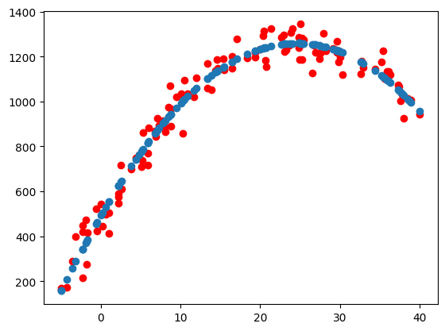

# 🚴‍♂️ Bike Rental Prediction using Polynomial Regression
My app link:https://polynomial-regression-nc7nh5a3ofo8aqrl6hk485.streamlit.app/

This project applies **Polynomial Regression** to predict bike rental counts based on **temperature**.  
The dataset used is `bike_poly.csv`, and all steps are implemented in the notebook `task.ipynb`.

---

## 🌍 Project Scenario
A city bike-sharing company wants to predict **demand** based on **temperature**.

- 📉 Too cold or too hot → fewer rentals  
- 📈 Moderate temperature → more rentals  
- 🔍 Compared **Linear Regression (rentals ~ temperature)** vs **Polynomial Regression (degree = 2 or 3)**  
- 📊 Evaluated performance with **R²** and **RMSE**  
- 🖼️ Visualized predictions vs actual rentals  

---

## 🤖 Model Training
- Fit **Linear Regression** as baseline  
- Applied **Polynomial Regression (degree = 2 or 3)**  

---

## 📏 Model Evaluation
- ✅ Root Mean Squared Error (RMSE)  
- ✅ R-squared (R²) Score  

---

## 📊 Output Visualizations

### 1️⃣ Actual vs Predicted Rentals

### 2️⃣ Polynomial Regression Fit

---

## 🖥️ Streamlit App

You can also interact with the model using this **Streamlit app**:

---

## 📈 Results

- 🔹 **Linear Regression** → Low R², higher RMSE (poor fit)  
- 🔹 **Polynomial Regression** → Higher R², lower RMSE (captures nonlinear trend better)  

---

## 📝 Conclusion

Polynomial Regression (degree = 2 or 3) provided a **much better fit** for predicting bike rentals compared to Linear Regression.  
It successfully captured the **nonlinear relationship** between **temperature and rentals**.  

⚠️ However, **real-world demand** also depends on other factors (weather, holidays, working days).  
Using only temperature makes predictions **less reliable** in practice.  

---

✨ Developed as part of a Machine Learning Regression Task 🚀
